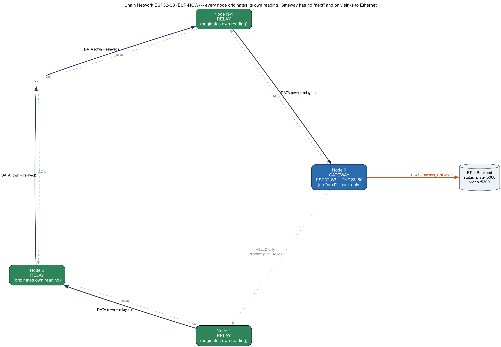
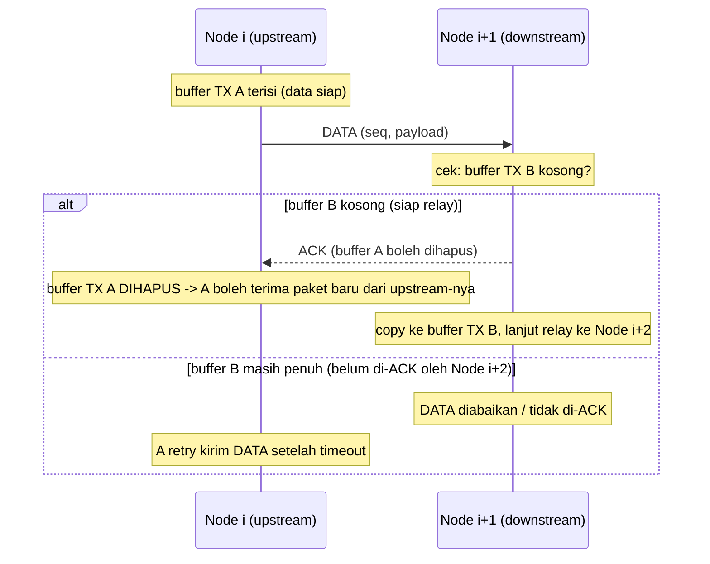
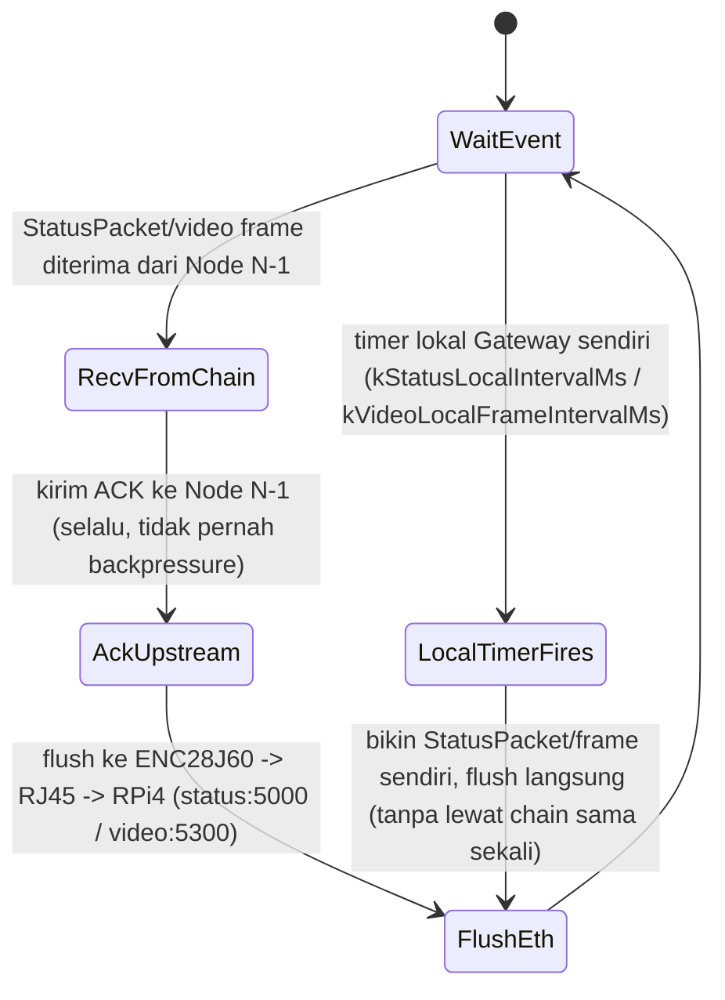
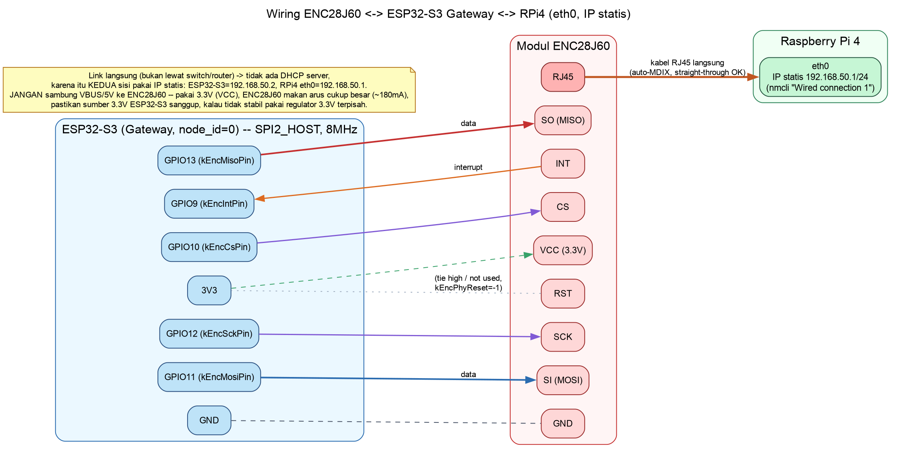

# Topologi Chain Network ESP32-S3 (ESP-NOW)

## 1. Gambaran Umum

- **N** node ESP32-S3 tersusun sebagai **chain** (bukan ring tertutup), saling terhubung secara **logis** lewat **ESP-NOW** (unicast ke MAC address tetangga, tanpa router/AP).
- **Tidak ada "node pertama"**: setiap node punya inisiatif sendiri untuk membuat dan mengirim data (`StatusPacket`) ke `next`-nya, dengan jadwal masing-masing (`kStatusLocalIntervalMs`). Data mengalir **searah**: tiap node hanya mengirim ke `next` dan hanya menerima dari `prev`.
- Tepat **satu node istimewa = Gateway**, yang tambahan punya modul **ENC28J60** (Ethernet SPI) ke **RJ45**. Semua node lain adalah **Relay Node** biasa.
- **Gateway tidak punya `next` sama sekali** — ia bukan bagian dari jalur relay chain, hanya **sink**: setiap `StatusPacket`/frame video yang sampai ke Gateway (dari `prev`-nya, atau dibuatnya sendiri) langsung di-flush ke ENC28J60 → RJ45 → RPi4, tidak pernah dibuat ulang/dikirim balik ke chain. Ini beda dari desain awal (single token yang berputar terus) — lihat poin 5.

Nomor "next"/"prev" tiap node tetap dihitung modulo `chain_size` (`next = (id+1)%N`, `prev = (id-1+N)%N`) supaya auto-discovery (poin 6) tetap sederhana, tapi secara **fungsional** ini bukan lingkaran: rantai relay sebenarnya cuma `Node 1 -> Node 2 -> ... -> Node N-1 -> Node 0 (Gateway)`. Node 1 memang punya `prev = Node 0` untuk keperluan HELLO/discovery, tapi Gateway tidak pernah mengirim `StatusPacket`/video ke situ — link itu cuma dipakai untuk saling kenal MAC address, tidak pernah membawa data.

## 2. Diagram Topologi



Sumber diagram: `topology.dot` (Graphviz, layout `circo`) di folder yang sama — regenerate dengan:

```sh
dot -Tpng -Gdpi=150 topology.dot -o topology.png
dot -Tsvg topology.dot -o topology.svg
```

**Legenda:**
- Panah solid biru tebal: arah aliran **DATA** (`StatusPacket`/video, searah chain, satu arah tetap).
- Panah putus-putus abu-abu: **ACK** (sinyal "buffer sudah dihapus/boleh kirim lagi"), mengalir berlawanan arah data, **hanya sebagai kontrol alir per-hop**.
- Panah titik-titik abu-abu (Node 0 -> Node 1): **HELLO saja** untuk keperluan auto-discovery (poin 6) — Gateway tidak pernah kirim DATA ke situ.
- Panah oranye: satu-satunya link keluar chain, dari Gateway ke RPi4 lewat ENC28J60/RJ45 (dua port: status/plat dan video).

### ASCII fallback (kalau gambar tidak ter-render)

```
                DATA →                DATA →                  DATA →
         ┌───────────┐         ┌───────────┐           ┌───────────┐
   ...──▶│  Node 1   │────────▶│  Node 2   │──▶ ... ──▶ │ Node N-1  │───┐
         │  (RELAY)  │◀ - - - -│  (RELAY)  │◀── ...  ── │  (RELAY)  │   │
         └───────────┘  ACK ←  └───────────┘    ACK ←   └───────────┘   │ DATA
                                                                          ▼
                                                                   ┌───────────┐
                                                                   │  Node 0   │
                                                                   │ (GATEWAY) │
                                                                   └─────┬─────┘
                                                                         │ RJ45 (ENC28J60, SPI)
                                                                         ▼
                                                                  [ RPi4 backend ]
```

Tidak ada panah balik dari Node 0 ke Node 1 — Gateway tidak punya `next`. Setiap node (termasuk Gateway) juga membuat `StatusPacket`/frame video-nya sendiri secara independen (lihat poin 5), bukan cuma meneruskan.

## 3. Aturan Flow Control ("stop-and-wait per-hop")

Prinsip inti: **satu node hanya boleh menerima paket baru dari upstream-nya setelah paket yang IA kirim ke downstream sudah "dihapus"** (dikonfirmasi diterima/diproses oleh downstream, buffer TX-nya bebas lagi). Ini mencegah node menumpuk paket dan memastikan data hanya mengalir satu arah dengan kecepatan mengikuti node paling lambat (backpressure alami).

Setiap link antar tetangga (i → i+1) punya slot buffer TX berkapasitas **1 paket**:



- Jika downstream **belum siap** (buffer TX-nya masih menunggu ACK dari node berikutnya), ia **tidak mengirim ACK** → upstream akan retry setelah timeout. Efeknya: kemacetan di satu titik akan "menjalar mundur" (backpressure), memaksa seluruh chain melambat mengikuti node paling lambat, tapi arah data tetap satu arah dan tidak ada paket yang tertumpuk/hilang.
- Karena setiap hop punya buffer sendiri, beberapa paket bisa berada di chain sekaligus (pipelined per-hop), asal masing-masing hop mematuhi aturan 1-buffer-1-paket di atas.

## 4. Perilaku Khusus Node Gateway



Poin penting: Gateway **tidak** punya `next` dan **tidak pernah** mengirim data ke chain lagi. Ia murni **sink**: baik data yang di-relay dari `prev` (Node N-1) maupun data yang dibuatnya sendiri dari LuckFox-nya sendiri langsung di-flush ke RPi4, tidak ada siklus "buat token baru, kirim ke Node 1" seperti desain lama. Karena Gateway tidak pernah kehabisan buffer (bukan antrian, langsung flush), ia selalu meng-ACK apa pun yang datang dari `prev` -- backpressure hanya terjadi di hop-hop relay biasa (poin 3).

## 5. Data per Node: `StatusPacket` Independen (Bukan Token Kolektif)

Desain awal (satu token kolektif yang mengumpulkan entry semua node per putaran) sudah **diganti total**. Sekarang setiap node membuat paket miliknya sendiri, kapan saja, tidak menunggu apa pun datang dari `prev` lebih dulu:

- `StatusPacket { origin_node_id, seq, occupied, plate }` (lihat `main/protocol.h`) — satu paket = satu pembacaan dari satu node. Tidak ada lagi `entries[]`/`count`/`cycle_id`.
- Tiap node (kecuali Gateway) punya timer sendiri (`kStatusLocalIntervalMs`, saat ini 2000ms) yang membuat `StatusPacket` baru dari `readLocalStatus()`-nya sendiri, lalu memasukkannya ke `g_outQueue` yang sama dengan paket yang di-relay dari `prev` — **inilah yang membuat "punya data sendiri" dan "meneruskan data tetangga" saling berselang-seling (interleaved)** tanpa scheduler terpisah, cukup satu FIFO.
- Tiap `StatusPacket` diberi `(origin_node_id, seq)` sebagai identitas unik untuk dedup (kalau ACK ke `prev` hilang dan `prev` retransmit, penerima cukup ACK ulang tanpa memproses/forward dua kali).
- **Gateway** juga punya timer lokal yang sama, tapi karena tidak punya `next`, hasilnya langsung di-`gateway_uplink::flush()` — tidak pernah masuk antrian.
- Karena tiap node independen, **asal (`origin_node_id`) setiap pembacaan selalu jelas** sampai ke RPi4 — tidak butuh urutan/posisi dalam token untuk tahu itu data dari node mana.

### Video: jalur & tagging terpisah

Video (3 stream 600x400 per LuckFox) **tidak** lewat ESP-NOW (terlalu besar untuk frame 250B) — lewat radio WiFi yang sama tapi jalur AP+STA terpisah (`main/video_relay.*`, lihat `README.md`/kode untuk detail daisy-chain-nya). Tiap frame dibungkus `FrameHeader { origin_node_id, stream_id, seq, data_len }` sebelum data mentahnya, jadi origin node dan kamera keberapa (`stream_id`, 0..`kVideoStreamsPerNode-1`) selalu ikut menempel di setiap frame, sama seperti `StatusPacket` di atas.

Di Gateway, frame video (baik hasil relay dari `prev` maupun buatan LuckFox Gateway sendiri) diteruskan oleh `gateway_uplink::flushVideo()` ke RPi4 lewat koneksi TCP terpisah (`kVideoBackendPort`, persisten -- tidak reconnect tiap frame seperti `flush()` untuk status/plat, karena frekuensi kedatangannya jauh lebih tinggi). Header yang dikirim ke RPi4 sama isinya: `{origin_node_id, stream_id, seq, data_len}` + data.

### Penamaan node per RPi (bukan di firmware)

Firmware hanya pernah tahu `node_id` numerik -- tidak ada nama di ESP32 mana pun. Supaya RPi bisa menampilkan "kamera per node yang dinamai satu-satu" tanpa perlu reflash firmware tiap kali sebuah spot diberi nama ulang, pemetaan `node_id -> nama` ada di sisi RPi lewat `backend/node_names.json` **di parent repo** (bukan submodule ini -- lihat poin 8), dibaca oleh `backend/video_listener.py` dan `backend/status_listener.py`. Karena video dan status/plat sama-sama membawa `origin_node_id`, keduanya bisa dikorelasikan/di-label dengan nama yang sama.

## 6. Auto-Discovery Neighbor (Tanpa Hardcode MAC)

MAC address `next`/`prev` neighbor **tidak di-hardcode saat compile** — setiap node menjalankan firmware image yang identik dan menemukan tetangganya sendiri saat boot:

- Identitas node (`node_id`, `chain_size`) tetap perlu di-provisioning manual sekali per unit (disimpan di NVS), karena urutan fisik/logis chain tidak bisa ditebak dari broadcast WiFi semata.
- Saat boot, node broadcast `HELLO {node_id, chain_size}` secara periodik (ESP-NOW broadcast ke `FF:FF:FF:FF:FF:FF`).
- Semua node saling mendengarkan HELLO dan mencatat `node_id -> MAC` pengirim. Begitu MAC untuk `next_id = (id+1) % N` dan `prev_id = (id-1+N) % N` sudah diketahui, node mendaftarkan keduanya sebagai ESP-NOW peer dan pindah dari state `DISCOVERING` ke `IDLE` (siap jalan normal).
- HELLO tetap dikirim (dengan interval lebih jarang) setelah `RUNNING`, sebagai keep-alive jika ada node yang reboot dan perlu di-re-discover oleh tetangganya.

## 7. Peran & Konfigurasi per Node

| Role | Jumlah | Tugas | Hardware tambahan |
|---|---|---|---|
| `GATEWAY` | 1 (Node 0) | Terima `StatusPacket`/video dari `prev` → flush ke RJ45. Buat `StatusPacket`/video sendiri → flush langsung (tanpa lewat chain). Tidak punya `next`. | ENC28J60 (SPI) |
| `RELAY`   | N-1 | Buat `StatusPacket`/video sendiri secara independen + relay yang diterima dari `prev`, keduanya diselang-seling lewat satu antrian ke `next`, tunduk stop-and-wait | - |

Konfigurasi per node hanya butuh dua nilai (provisioning sekali via console UART, tersimpan di NVS):
- `node_id` (0 = Gateway, 1..N-1 = Relay)
- `chain_size` (N)

MAC address tetangga **tidak** perlu dikonfigurasi manual — didapat otomatis lewat auto-discovery di atas.

---

## 8. Implementasi

Firmware ada di root repo ini, **ESP-IDF native** (bukan Arduino/PlatformIO):

- `main/protocol.h` — struct wire format ESP-NOW: `HelloPacket`, `StatusPacket` (satu pembacaan per node, poin 5), `AckPacket`.
- `main/espnow_transport.*` — bring-up `esp_wifi`/`esp_now` (mode `APSTA`, dipakai bersama `video_relay`) + antrian RX (WiFi task -> main loop).
- `main/provisioning.*` — baca `node_id`/`chain_size` dari NVS (`nvs.h` native), atau prompt di console UART (`SETID <id> <chain_size>`) kalau belum diprovisioning.
- `main/chain_node.*` — state machine inti: discovery (poin 6) + chain hop-by-hop dengan stop-and-wait per-hop (poin 3) + tiap node originate `StatusPacket` sendiri (poin 5). Gateway tidak forward, cuma sink.
- `main/video_relay.*` — jalur video terpisah (WiFi AP+STA daisy-chain + TCP di `kVideoPort`, di luar ESP-NOW): tiap node SoftAP untuk `prev`, STA ke `next`'s AP. Frame dibungkus `FrameHeader{origin_node_id, stream_id, seq, data_len}`. Buffer PSRAM dengan fallback ke internal heap kalau PSRAM tidak tersedia.
- `main/gateway_uplink.*` — bring-up ENC28J60 lewat komponen resmi `espressif/enc28j60` (esp_eth MAC/PHY driver, IP statis) + dua jalur kirim ke RPi4: `flush()` (satu baris teks `node:occupied:plate` per pembacaan, `kBackendPort` 5000, connect-per-kirim) dan `flushVideo()` (frame biner dengan header yang sama seperti `FrameHeader`, `kVideoBackendPort` 5300, koneksi TCP persisten lewat task tersendiri).
- `main/main.cpp` — `app_main`: NVS init, WiFi/ESP-NOW/AP+STA netif init, Ethernet init (kalau Gateway), lalu loop chain.

Ini submodule firmware ESP32-S3 saja. Demo listener sisi RPi4 (`status_listener.py`, `video_listener.py`, `node_names.json`) ada di `backend/` pada **parent repo**, di luar submodule ini -- lihat root `README.md`.

Lihat `README.md` (root submodule ini) untuk cara build, flash (termasuk catatan port USB mana yang auto-reset tanpa tombol), dan provisioning tiap node.

## 9. Wiring ENC28J60 <-> ESP32-S3 Gateway <-> RPi4



Sumber: `enc28j60_wiring.dot` di folder yang sama, regenerate dengan `dot -Tpng -Gdpi=150 enc28j60_wiring.dot -o enc28j60_wiring.png`.

Pin SPI (lihat `main/config.h`, `SPI2_HOST` @ 8MHz):

| ENC28J60 | ESP32-S3 (Gateway) |
|---|---|
| CS | GPIO10 |
| SCK | GPIO12 |
| SI (MOSI) | GPIO11 |
| SO (MISO) | GPIO13 |
| INT | GPIO9 |
| VCC | 3V3 |
| GND | GND |
| RST | tidak dipakai (`phyConfig.reset_gpio_num = -1`) |

**RJ45 ENC28J60 disambung kabel langsung ke `eth0` RPi4** (bukan lewat switch/router). Karena link langsung tidak ada DHCP server, kedua sisi pakai **IP statis**:

- ESP32-S3 Gateway: `192.168.50.2/24` (`kEthStaticIp` di `config.h`)
- RPi4 `eth0`: `192.168.50.1/24`, di-set sekali via:
  ```sh
  sudo nmcli connection modify "Wired connection 1" ipv4.method manual ipv4.addresses 192.168.50.1/24
  sudo nmcli connection up "Wired connection 1"
  ```
- `kBackendHost` di `config.h` otomatis mengikuti `kEthStaticGateway` (192.168.50.1). `gateway_uplink::flush()` mengirim tiap pembacaan status/plat ke `kBackendHost:kBackendPort` (5000, connect-per-kirim), `gateway_uplink::flushVideo()` mengirim tiap frame video ke `kBackendHost:kVideoBackendPort` (5300, koneksi persisten).

RPi4 `eth0` tidak dipakai untuk apa pun selain link ini (koneksi LAN/internet RPi4 tetap lewat `wlan0`), jadi aman dipakai eksklusif untuk Gateway.

### Belum diimplementasikan / TODO

- **Self-healing/re-routing**: kalau satu link putus permanen (retry habis terus gagal), chain saat ini hanya log warning dan terus retry — belum ada mekanisme lompat/skip node mati.
- **Framing/API backend asli**: `gateway_uplink::flush()` (teks `node:occupied:plate\n`) dan `flushVideo()` (biner `FrameHeader`+data) sudah jalan dan teruji end-to-end lewat `backend/status_listener.py` dan `backend/video_listener.py` di parent repo (demo listener, bukan backend ParkingVision sungguhan) — perlu disesuaikan kalau API backend final beda framing-nya.
- **Payload sensor asli**: `readLocalStatus()` di `chain_node.cpp` dan `localProducerTask()` di `video_relay.cpp` masih placeholder (toggle occupied + plat dummy, frame acak), perlu dihubungkan ke data asli dari LuckFox (motion -> AI deteksi mobil -> occupancy -> OCR plat, lewat SPI).
- **Video relay**: `main/video_relay.*` (WiFi AP+STA daisy-chain + TCP, terpisah dari ESP-NOW) sudah jalan dan teruji di 2 node termasuk forward video Gateway ke RPi4, tapi sumber video-nya masih placeholder simulasi sampai integrasi SPI LuckFox ditulis.
- **Backend ParkingVision sungguhan**: `backend/*.py` (parent repo, bukan bagian submodule ini) saat ini cuma demo listener yang membuktikan data bisa dipisah/diberi nama per node (tulis frame ke file, log ke stdout) — bukan aplikasi tampilan/API sungguhan.
