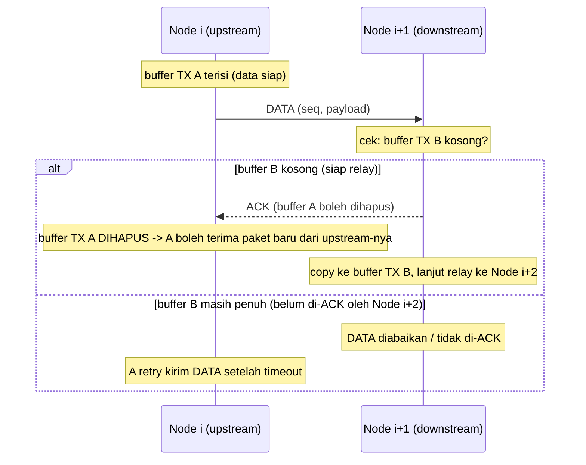
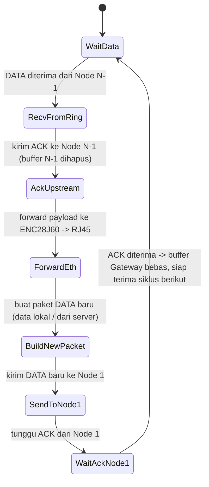

# Topologi Ring Network ESP32-S3 (ESP-NOW)

## 1. Gambaran Umum

- **N** node ESP32-S3 tersusun melingkar (ring), saling terhubung secara **logis** lewat **ESP-NOW** (unicast ke MAC address tetangga berikutnya, tanpa router/AP).
- Data mengalir **searah** (misal searah jarum jam): tiap node hanya mengirim ke **downstream neighbor**-nya (node berikutnya dalam ring) dan hanya menerima dari **upstream neighbor**-nya (node sebelumnya).
- Tepat **satu node istimewa = Gateway**, yang tambahan punya modul **ENC28J60** (Ethernet SPI) ke **RJ45**. Semua node lain adalah **Relay Node** biasa.
- Ring ini secara logis bukan "muter tanpa henti" — Gateway adalah titik **asal & tujuan** aliran data:
  - Paket yang datang dari arah ring (dari node terakhir) **berhenti di Gateway** dan diteruskan ke ENC28J60 → RJ45 → jaringan LAN/server.
  - Gateway lalu **membuat paket baru** dan mengirimkannya ke node pertama di ring, mengulang siklus.

## 2. Diagram Topologi


Sumber diagram: `topology.dot` (Graphviz, layout `circo`) di folder yang sama — regenerate dengan:

```sh
dot -Tpng -Gdpi=150 topology.dot -o topology.png
dot -Tsvg topology.dot -o topology.svg
```

**Legenda:**
- Panah solid biru tebal: arah aliran **DATA** (searah ring, satu arah tetap).
- Panah putus-putus abu-abu: **ACK** (sinyal "buffer sudah dihapus/boleh kirim lagi"), mengalir berlawanan arah data, **hanya sebagai kontrol alir per-hop**, bukan bagian dari data yang beredar di ring.
- Panah oranye: link keluar ring, satu-satunya, dari Gateway ke LAN/backend lewat ENC28J60/RJ45.

### ASCII fallback (kalau gambar tidak ter-render)

```
        DATA →                DATA →                DATA →
 ┌───────────┐         ┌───────────┐         ┌───────────┐
 │  Node 0   │────────▶│  Node 1   │────────▶│  Node 2   │──▶ ... ──▶ Node N-1
 │ (GATEWAY) │◀ - - - -│  (RELAY)  │◀ - - - -│  (RELAY)  │◀── ...  ──┐
 └─────┬─────┘  ACK ←  └───────────┘  ACK ←   └───────────┘          │
       │                                                              │
       │ RJ45 (ENC28J60, SPI)                          DATA →         │
       ▼                                                              │
  [ LAN / Server ]                                Node N-1 ─────────▶ Node 0 (Gateway)
                                                            ◀ - - - - ACK
```

## 3. Aturan Flow Control ("stop-and-wait per-hop")

Prinsip inti: **satu node hanya boleh menerima paket baru dari upstream-nya setelah paket yang IA kirim ke downstream sudah "dihapus"** (dikonfirmasi diterima/diproses oleh downstream, buffer TX-nya bebas lagi). Ini mencegah node menumpuk paket dan memastikan data hanya mengalir satu arah dengan kecepatan mengikuti node paling lambat (backpressure alami).

Setiap link antar tetangga (i → i+1) punya slot buffer TX berkapasitas **1 paket**:



- Jika downstream **belum siap** (buffer TX-nya masih menunggu ACK dari node berikutnya), ia **tidak mengirim ACK** → upstream akan retry setelah timeout. Efeknya: kemacetan di satu titik akan "menjalar mundur" (backpressure), memaksa seluruh ring melambat mengikuti node paling lambat, tapi arah data tetap satu arah dan tidak ada paket yang tertumpuk/hilang.
- Karena setiap hop punya buffer sendiri, beberapa paket bisa berada di ring sekaligus (pipelined per-hop), asal masing-masing hop mematuhi aturan 1-buffer-1-paket di atas.

## 4. Perilaku Khusus Node Gateway



Poin penting: Gateway **tidak** meneruskan paket yang sama secara fisik berputar terus di ring. Paket yang datang dari arah ring **berakhir** di Gateway (keluar lewat RJ45), dan paket yang **masuk ke ring** berikutnya adalah paket baru yang dibuat Gateway — sama seperti node relay lain, pengiriman paket baru ini tetap tunduk pada aturan stop-and-wait (baru boleh kirim lagi setelah ACK dari Node 1 diterima).

## 5. Data Lokal per Node: Paket sebagai "Token" yang Mengumpulkan Entry

Tiap RELAY node juga punya data sendiri untuk disisipkan (bukan cuma meneruskan). Alih-alih membuat paket data terpisah (yang butuh arbitrase dengan trafik relay), paket DATA didesain sebagai **token tunggal yang mengumpulkan satu entry dari tiap node saat lewat**:

- Paket berisi `entries[]` (list `{node_id, value}`) + `count` (berapa entry yang sudah terisi) + `cycle_id` (nomor putaran, dibuat Gateway).
- Tiap RELAY yang menerima token: **menambahkan entry-nya sendiri** (`entries[count] = {my_id, local_value}`, `count++`) sebelum meneruskan ke downstream. Tidak ada paket data terpisah, tidak ada arbitrase.
- Gateway yang menerima token (sudah berisi entry dari semua relay): **flush** `entries[]` ke ENC28J60/RJ45, lalu bikin token baru kosong (`cycle_id + 1`, `count = 0`) dan kirim ke Node 1 — inilah "paket baru dikirim ke node lain lagi" yang dimaksud di poin 1.
- Karena hanya ada **satu token yang beredar** per waktu (Gateway baru membuat token berikutnya setelah token sebelumnya selesai satu putaran), tidak ada dua "sumber data" yang berebut buffer TX node manapun.

## 6. Auto-Discovery Neighbor (Tanpa Hardcode MAC)

MAC address `next`/`prev` neighbor **tidak di-hardcode saat compile** — setiap node menjalankan firmware image yang identik dan menemukan tetangganya sendiri saat boot:

- Identitas node (`node_id`, `ring_size`) tetap perlu di-provisioning manual sekali per unit (disimpan di NVS), karena urutan fisik/logis ring tidak bisa ditebak dari broadcast WiFi semata.
- Saat boot, node broadcast `HELLO {node_id, ring_size}` secara periodik (ESP-NOW broadcast ke `FF:FF:FF:FF:FF:FF`).
- Semua node saling mendengarkan HELLO dan mencatat `node_id -> MAC` pengirim. Begitu MAC untuk `next_id = (id+1) % N` dan `prev_id = (id-1+N) % N` sudah diketahui, node mendaftarkan keduanya sebagai ESP-NOW peer dan pindah dari state `DISCOVERING` ke `IDLE` (siap jalan normal).
- HELLO tetap dikirim (dengan interval lebih jarang) setelah `RUNNING`, sebagai keep-alive jika ada node yang reboot dan perlu di-re-discover oleh tetangganya.

## 7. Peran & Konfigurasi per Node

| Role | Jumlah | Tugas | Hardware tambahan |
|---|---|---|---|
| `GATEWAY` | 1 (Node 0) | Terima token dari upstream → flush ke RJ45 → buat & kirim token baru ke ring | ENC28J60 (SPI) |
| `RELAY`   | N-1 | Terima token dari upstream → sisipkan entry lokal → forward ke downstream, tunduk stop-and-wait | - |

Konfigurasi per node hanya butuh dua nilai (provisioning sekali via console UART, tersimpan di NVS):
- `node_id` (0 = Gateway, 1..N-1 = Relay)
- `ring_size` (N)

MAC address tetangga **tidak** perlu dikonfigurasi manual — didapat otomatis lewat auto-discovery di atas.

---

## 8. Implementasi

Firmware ada di root repo ini, **ESP-IDF native** (bukan Arduino/PlatformIO):

- `main/protocol.h` — struct wire format (`HelloPacket`, `TokenPacket`, `AckPacket`).
- `main/espnow_transport.*` — bring-up `esp_wifi`/`esp_now` + antrian RX (WiFi task -> main loop).
- `main/provisioning.*` — baca `node_id`/`ring_size` dari NVS (`nvs.h` native), atau prompt di console UART (`SETID <id> <ring_size>`) kalau belum diprovisioning.
- `main/ring_node.*` — state machine inti: discovery (poin 6) + single-token ring dengan stop-and-wait per-hop (poin 3) + transform token (poin 5).
- `main/gateway_uplink.*` — bring-up ENC28J60 lewat komponen resmi `espressif/enc28j60` (esp_eth MAC/PHY driver) + kirim data terkumpul ke backend (BSD socket/lwIP) tiap lap selesai.
- `main/main.cpp` — `app_main`: NVS init, WiFi/ESP-NOW init, Ethernet init (kalau Gateway), lalu loop ring.

Lihat `README.md` (root repo ini) untuk cara build, flash (termasuk catatan port USB mana yang auto-reset tanpa tombol), dan provisioning tiap node.

### Belum diimplementasikan / TODO

- **Self-healing/re-routing**: kalau satu link putus permanen (retry habis terus gagal), ring saat ini hanya log warning dan terus retry — belum ada mekanisme lompat/skip node mati.
- **Framing data ke backend**: `gateway_uplink::flush()` masih pakai format teks placeholder (`cycle,count;node:value,...`) via TCP polos ke `kBackendHost:kBackendPort` — perlu disesuaikan dengan API backend ParkingVision yang sebenarnya.
- **Payload sensor asli**: `readLocalValue()` di `ring_node.cpp` masih placeholder (counter naik), perlu dihubungkan ke pembacaan sensor parkir sesungguhnya per node.
